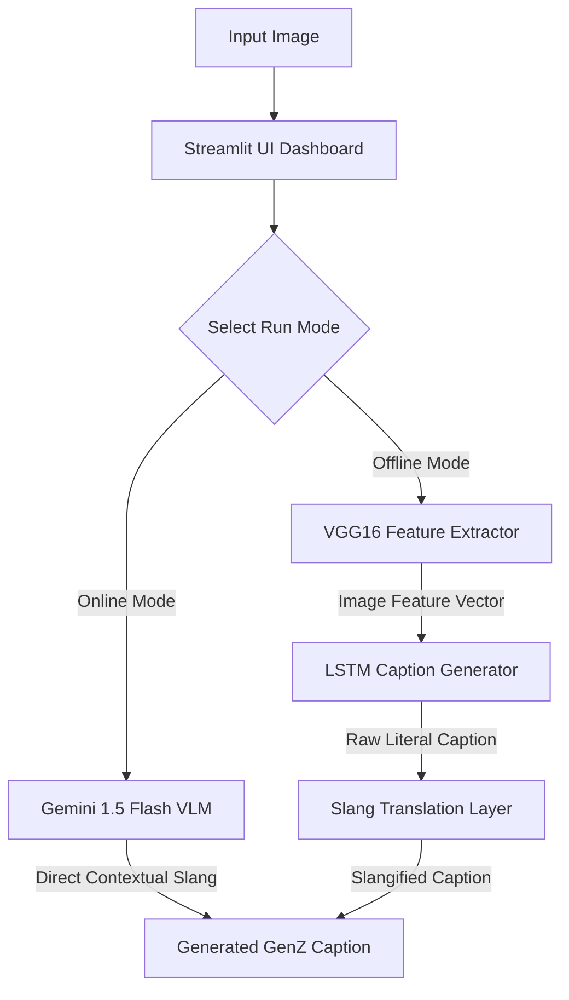
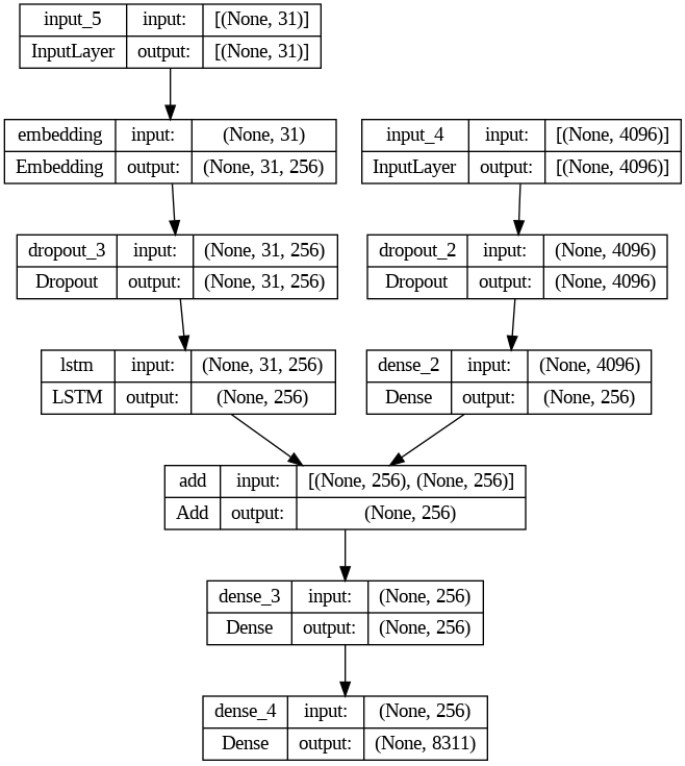

# Image to GenZ Caption Generator ⚡️

Image to GenZ Caption Generator is a deep learning and visual large language model (VLM) application that converts images into engaging, slang-filled social media captions with matching emojis.

---

## 📌 Problem Statement
Traditional image captioning systems are designed to produce dry, literal descriptions (e.g., *"a black dog is running on the grass"*). While accurate, these lack the creativity, personality, and contextual humor desired for modern social media posts. This project bridges that gap by combining classic computer vision pipelines and modern Generative AI to generate punchy, context-aware captions styled in modern Gen Z slang.

---

## 🚀 Key Features
- **Dual-Mode System**:
  - **Online Mode (VLM)**: Leverages the Google Gemini 1.5 Flash model to provide deep visual understanding, brand recognition, and highly contextual slang captions.
  - **Offline Mode (CNN-LSTM)**: Fallback local pipeline using a custom VGG16 feature extractor and an LSTM sequence generator trained on the Flickr8k dataset.
- **Slang Translation Engine**: A rule-based mapping engine that dynamically translates standard, literal captions into Gen Z slang (e.g., `dog` $\rightarrow$ `doggo`, `running` $\rightarrow$ `speedrunning life`) and appends random contextual endings like `no cap 🧢` and `fr fr 💯`.
- **Interactive Streamlit Web Dashboard**: A user-friendly frontend allowing seamless image uploads, model toggles, and instant caption outputs.

---

## 🗺️ System Architecture & Workflow



---

## 🛠️ Technologies & Libraries
- **Deep Learning & CV**: TensorFlow, Keras, VGG16
- **Generative AI API**: Google GenAI SDK (`google-generativeai`)
- **Frontend / Deployment**: Streamlit
- **Data & Image Processing**: NumPy, Pillow, Pickle, OpenCV
- **Large File Management**: Git LFS

---

## 📊 Dataset & Preprocessing
The offline model was trained on the **Flickr8k Dataset** containing 8,000 images, each paired with 5 different literal descriptions.
1. **Image Preprocessing**: Images are resized to $224 \times 224$ pixels and preprocessed using standard ImageNet normalization.
2. **Text Cleaning**: Captions are cleaned by converting characters to lowercase, removing digits and punctuation, and wrapping them in `start` and `end` tags (e.g., `"start dog runs in grass end"`).
3. **Tokenization**: Words are tokenized using Keras's `Tokenizer` to map text tokens to integer indexes, generating a final vocabulary size of 8,311 words.

---

## 🧠 Deep Learning Architecture (Offline Pipeline)

### 1. CNN Feature Extractor (VGG16)
We use a pre-trained **VGG16** model (pre-trained on ImageNet). The final classification layer is removed, leaving the second-to-last fully connected layer (`fc2`) to extract a dense **4096-dimensional feature vector** representing the image's visual context.

### 2. LSTM Decoder (Sequence Generator)
A merge-architecture deep neural network combined both visual and textual features:
- **Image Feature Network**: Reduces the 4096-D vector to a 256-D dense representation.
- **Sequence Processing Network**: Takes padded token sequences (maximum sequence length of 31), passes them through a 256-D Embedding Layer, and feeds them into an **LSTM layer** with 256 memory units.
- **Decoder Network**: Merges both inputs, adds dropout regularizations, and maps the output to a final softmax classification layer over the 8,311-word vocabulary.

#### Model Architecture Map
The generated model pipeline behaves as follows:


---

## 📈 Evaluation & Results (Offline Model)
The local offline model was evaluated on a 10% test split from the Flickr8k dataset, achieving a **BLEU Score of 0.53** for caption quality:


---

## 🤖 Gemini API VLM Integration
In online mode, the application invokes the **Gemini 1.5 Flash** model, combining the image binary with a customized generation instruction prompt:
> *"Analyze this image and write a caption in modern Gen Z slang. Use popular terms like 'no cap', 'fr fr', 'cooked', 'vibes', 'rizz', 'aura', 'slay', 'giving', 'doing side quests', 'npc', etc. Keep it short, punchy, and include 1-2 relevant emojis."*

This allows the app to comprehend complex relationships, brand logos, text written inside the image, and modern styling configurations that static datasets cannot capture.

---

## ⚙️ Installation & Setup

### Prerequisites
This project uses **Git LFS (Large File Storage)** to manage large model files (`Image_Caption_Generator.h5` and `features.pickle`). Ensure Git LFS is installed before cloning:
- **macOS**: `brew install git-lfs`
- **Windows / Linux**: Download from [git-lfs.github.com](https://git-lfs.github.com/)

Once installed, run:
```bash
git lfs install
```

### Steps

1. **Clone the Repository**:
   ```bash
   git clone https://github.com/taru469/Image-to-GenZCaption.git
   cd Image-to-GenZCaption
   ```

2. **Install Dependencies**:
   ```bash
   pip install -r requirements.txt
   ```

3. **Get a Gemini API Key** *(Optional, for Online Mode)*:
   Get a free developer API key from [Google AI Studio](https://aistudio.google.com/) and set it in your environment:
   ```bash
   export GEMINI_API_KEY="your_api_key_here"
   ```

---

## 🖥️ How to Run
Launch the Streamlit web dashboard:
```bash
streamlit run deployment.py
```
Open the provided local URL (typically `http://localhost:8501`) in your browser, upload an image, choose a mode, and generate captions!

---

## 🖼️ Sample Outputs

| Input Image | Selected Mode | Output Caption |
| :--- | :--- | :--- |
| **`testing/boy_beach.jpg`** | Online (Gemini VLM) | *"lil bro is speedrunning side quests on the beach, got that main character energy fr fr 🌊⚽️"* |
| **`testing/girl_in_snow.jpg`** | Online (Gemini VLM) | *"queen is rocking the winter drip, absolute frosty vibes ❄️💅"* |
| **`testing/boy_beach.jpg`** | Offline (Local LSTM) | *"lil bro playing on beach vibes aura points +1000 📈"* |

---

## 🔮 Future Improvements
- **Local VLM Support**: Integrate smaller, local vision LLMs (like `Moondream` or `Llama-3-Vision` via Ollama) to run advanced visual analysis entirely offline.
- **Caption Tone Selector**: Add options to toggle between different slang subcultures (e.g., corporate slang, millennial humor, or Gen Z).
- **Batch Processing**: Support uploading multiple images to generate caption drafts in bulk.
